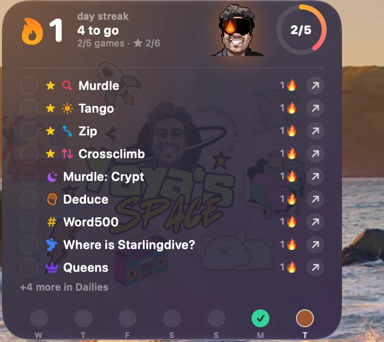
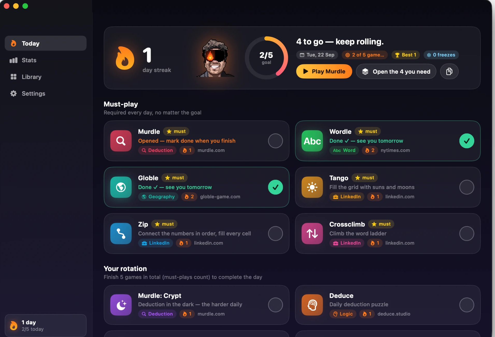

<p align="center">
  
</p>

<h1 align="center">Dailies</h1>

<p align="center">
  Every daily puzzle you actually play, in one place, with a streak you'd feel bad about breaking.<br>
  There is a pixel version of my face on the desktop and it judges me. It works.
</p>

<p align="center">
  
  
  
  
</p>

<p align="center">
  <a href="https://github.com/YahyaElghobashy/dailies-mac/releases/latest/download/Dailies-macOS-arm64.zip">
    
  </a>
</p>

<p align="center">
  
  &nbsp;&nbsp;
  
</p>

## Why this thing exists

I play Murdle, Wordle, Globle, the LinkedIn ones, Deduce, and a rotating cast of others. Every
morning I'd remember four of them, forget the rest, and lose whatever streak I had going. The
games don't talk to each other. Nobody is keeping score across them.

So: one rotation, one streak, one widget on the desktop that I cannot pretend I didn't see.

- **Pick your rotation** from 42 daily games (or add your own URL).
- **Set a goal** — "5 of them is a good day" — and **star the must-plays** that count no matter what.
- **Tick them off** from the widget, the menu bar, or the app. Clicking a game opens it in your browser.
- **The flame** grows with the streak and changes colour as it gets hotter.
- Miss a day? Every 7-day run earns a **streak freeze**, banked up to 2, spent silently on the day
  life happens. Mercy, but rationed.

## The visor keeps score

My pixel-art face sits in the widget, the app header, and the menu bar, and it reacts to the day:

| | State | When |
|---|---|---|
|  | **idle** | You haven't played anything yet. Disappointing. |
|  | **half** | Half the goal (rounded down). Left lens catches fire. |
|  | **goal** | Goal hit *and* every must-play done. Both lenses lit. |
|  | **crazed** | Every enabled game, one day. You have a problem. Well done. |

## Install it (the honest version)

1. **[Download the zip](https://github.com/YahyaElghobashy/dailies-mac/releases/latest/download/Dailies-macOS-arm64.zip)**, unzip, drag `Dailies.app` to **Applications**.
2. Open it. macOS says *"Apple could not verify…"* — it can't, because I don't pay Apple $99 a year.
   **System Settings → Privacy & Security → Open Anyway**, then open it again.
3. Say yes to notifications (morning nudge, evening "your streak is about to die" alert). Or don't,
   the app works silently.
4. **Library** tab: switch on the games you actually play. **Settings**: set the daily goal and
   star your must-plays.
5. Right-click the desktop → **Edit Widgets** → search **Dailies** → drag a size out. Done.

No account, no sync, no server. Your streak lives in `~/Library/Application Support/Dailies` and
nowhere else.

## The widget

Four sizes. The circles are real buttons — tap to mark a game done. The game name opens it in your
browser. Must-plays float to the top, finished games sink.

| Size | Shows |
|---|---|
| Small | Flame, progress ring, next game |
| Medium | Progress, the next few games |
| Large | The checklist, the week strip, the mascot |
| **Extra Large** | The whole rotation in two columns (widgets can't scroll, so this is the fix) |

## Keys

| | |
|---|---|
| **⌘P** | Play the next unfinished game |
| **⇧⌘O** | Open every game you still owe today |
| **⇧⌘C** | Copy a share card of today |

## How the streak works

- A day is **perfect** when you hit the goal **and** finish every must-play. Perfect days chain.
- Days flip at **your** local midnight. The widget resets itself even if the app never opened.
- Every 7-day milestone banks a **streak freeze** (max 2). A missed day spends one automatically
  and quietly. Run out, and the flame goes back to zero like everyone else's.
- Per-game streaks are tracked too, so you can see which one you're actually loyal to.

## Build it yourself

```bash
./build.sh --install
```

Plain `swiftc` from the Command Line Tools, no Xcode, no project file, no package manager. The
script compiles the app and the WidgetKit extension, writes the Info.plists, hand-rolls the App
Intents metadata, signs both bundles, installs to `/Applications`, and kicks the widget host so the
new build actually shows up. `INSTALL_DIR=~/Applications ./build.sh --install` to put it elsewhere.

The mascot faces are generated: `Resources/MakeFaces.py` derives idle/half/goal from
`Resources/Art/face-src.png`, and `MakeCrazed.py` aligns the crazed render to the same framing.

## Under the hood, for the curious

| Piece | Where |
|---|---|
| Streak engine, game catalog, persistence | `Sources/Shared` |
| App: Today, Stats, Library, Settings, menu bar, notifications | `Sources/App` |
| Interactive widget, four families | `Sources/Widget` |

**No App Group.** macOS 15+ refuses App Group containers to apps without an Apple Developer team,
so the app and its sandboxed widget share one JSON file through a `temporary-exception` entitlement
instead. Same shared state, zero prompts, no $99.

**Widget looks grey?** That's macOS's "Automatic" widget style desaturating desktop widgets while
another app is in front. System Settings → Desktop & Dock → Widgets → Widget style → **Full colour**.

MIT licensed. Go keep your own streak.
